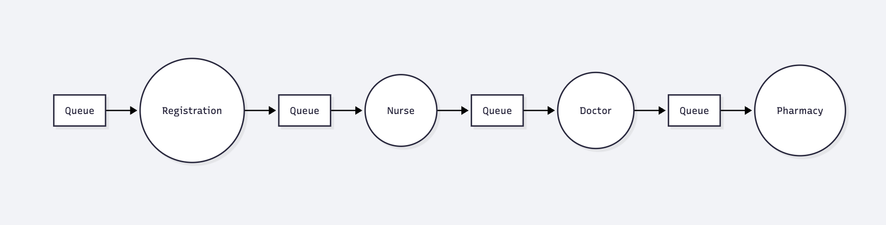
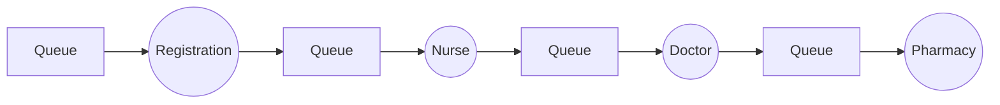
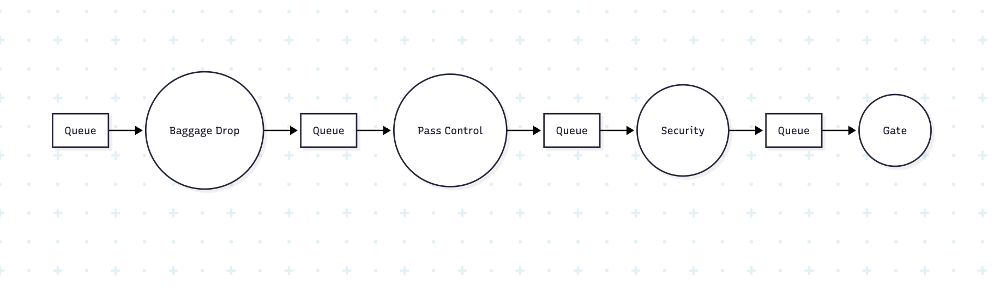

## Task 3 (W) – Design of two systems

### 1. Hospital outpatient department
- Service Point 1: Registration desk
- Service Point 2: Nurse triage
- Service Point 3: Doctor consultation
- Service Point 4: Pharmacy counter



Diagram code in mermaid:

### 2. Airport check-in and security

- Service Point 1: Baggage drop

- Service Point 2: Boarding pass control

- Service Point 3: Security screening

- Service Point 4: Boarding gate


Diagram code in mermaid:
```mermaid code
flowchart LR
    Q1[Queue] --> B1((Baggage Drop))
    B1 --> Q2[Queue] --> B2((Pass Control))
    B2 --> Q3[Queue] --> S((Security))
    S --> Q4[Queue] --> G((Gate))
